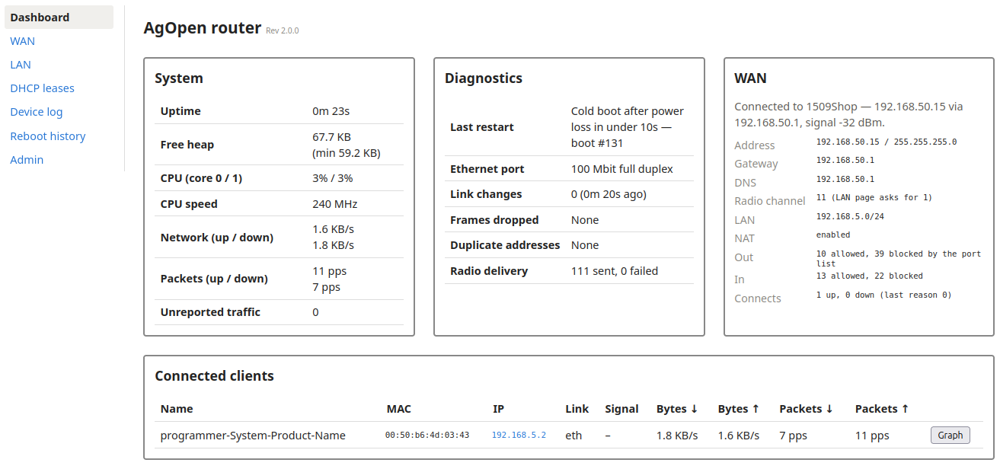
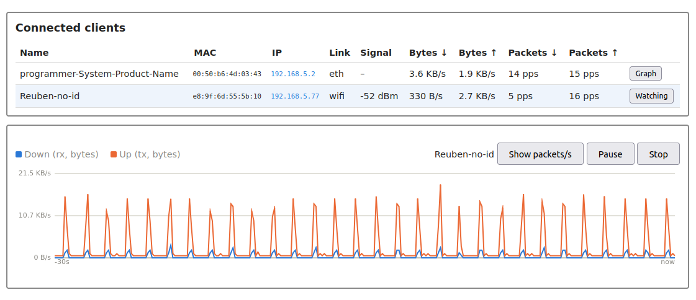

# wt32-bridge

Version: 2.1.0 (see [version.txt](version.txt); shown on the web UI as "Rev 2.1.0")

An ESP-IDF firmware project that turns a [WT32-ETH01](https://en.wireless-tag.com/product-item-2.html) (ESP32 + LAN8720 Ethernet PHY) module into an Ethernet↔WiFi bridge for [AgOpenGPS](https://github.com/AgOpenGPS-Official/AgOpenGPS). It bridges the wired Ethernet interface and a WiFi access point at the network layer, and serves a small web UI for configuration and live monitoring.

## Features

- Ethernet (LAN8720 PHY) ↔ WiFi AP network bridge (`esp_netif_br_glue`)
- Web UI with a page per concern: live status on the dashboard, WiFi settings on `/lan`
- Connected-client tracking and per-device traffic graphing
- System monitor (heap, uptime, etc.) surfaced on the web UI, refreshed every second
- DHCP lease table viewable in a browser (`/leases`), live state alongside what is in flash
- Device log viewable in a browser (`/logs`), not just over serial
- Remote syslog (RFC 5424 over UDP) and a downloadable log file, so the log outlives the device's 128-line buffer
- Configurable WiFi channel (1, 6, or 11)
- Optional WiFi as WAN (routed, NAT'd) with a destination-port allowlist, so an
  AgOpenGPS tablet can reach an NTRIP caster and a RustDesk session, and nothing else

## First boot

Out of the box the device brings up a WiFi access point and a wired port on one bridged
`192.168.5.0/24` network, with compiled-in defaults:

| | Default |
| --- | --- |
| WiFi SSID | `AOG hub` |
| WiFi password | `password` |
| Web UI login | `admin` / `admin` |
| Bridge address | `192.168.5.1` |

Changing the admin password is forced before the device will do anything else (see
[Web UI login](#web-ui-login)). **Changing it does not change the WiFi password** — the two
are separate, and a device left on the default PSK is joinable by anyone in range whatever
the admin password says. Set both, from `/admin` and the `wifi` console command respectively.

## Network and capacity

The addressing is compiled in (`main/main.c`) and not configurable from the UI or console:

| | Value | Set by |
| --- | --- | --- |
| Bridge address / netmask | `192.168.5.1` / `255.255.255.0` | `BRIDGE_IP`, `BRIDGE_NETMASK` |
| DHCP range, Ethernet port | `192.168.5.2` – `192.168.5.9` | `ETH_DHCP_START`, `ETH_DHCP_END` |
| DHCP range, WiFi | `192.168.5.10` – `192.168.5.101` | `WIFI_DHCP_START`, `WIFI_DHCP_END` |
| Concurrent DHCP leases | 100 (8 wired + 92 WiFi) | the four constants above |
| Addresses remembered across a reboot | 32 | `DHCP_SERVER_MAX_LEASES` |
| WiFi stations | 6 | `WIFI_CFG_MAX_STA_CONN` |
| Clients shown in the table | 16 | `CLIENT_TRACK_MAX_CLIENTS` |
| Bridge forwarding table | 32 MACs | `max_fdb_dyn_entries` |
| Client forgotten after | 5 minutes of silence | `CLIENT_AGE_OUT_US` |
| lwIP socket descriptors | 18 | `CONFIG_LWIP_MAX_SOCKETS` |
| WAN | off by default | `wan_cfg` in NVS |
| Allowed egress rules | 12 | `WAN_CFG_MAX_PORTS` |
| NAT sessions | 256 | `IP_NAPT_MAX`, set in the root `CMakeLists.txt` |
| NAT UDP idle timeout | 60 s | `IP_NAPT_TIMEOUT_MS_UDP`, same place |

Static addresses outside both ranges work fine and are not subject to any of these
limits.

### The socket descriptors are accounted for, not spare

`CONFIG_LWIP_MAX_SOCKETS` is the whole supply for the device, and all 18 are spoken for:
16 to the web server (13 sessions plus a listener and a control socket pair — `esp_http_server`
requires `max_open_sockets + 3`), one to the DHCP server, one to the syslog sender. Adding
anything that opens a socket means raising this number in the same change.

The [WAN](#wan) deliberately adds none: NAPT lives inside
`ip4_input`/`ip4_forward`, the station's DHCP client uses lwIP's raw `udp_pcb` API, and the
packet filter is a pair of `netif` function pointers.

The NTP client is the case that looks like it should break this and does not, which
is worth writing down because the reasoning is not visible from the call site. lwIP's SNTP
client allocates a raw `udp_pcb` (`udp_new_ip_type()` in `sntp.c`), not a socket, and name
resolution goes through `netconn_gethostbyname()`, which passes a `dns_api_msg` to the tcpip
thread and waits on a semaphore — also no descriptor. So `getaddrinfo()` in `clock_time.c`
costs nothing from this budget despite looking like ordinary socket code. A DNS *relay*, which
would have to bind and listen, still would.

Getting it wrong does not fail at startup, which is what makes it worth writing down. The
new socket opens fine — there are only four in use while the device is booting — and the
shortage appears later as `accept()` failing under load, which reads from a browser as
"Lost connection to bridge". `lru_purge_enable` does not cover it: that fires when the
server's *session table* fills, not when lwIP has no descriptor left to accept with.

### Each port has its own DHCP range

Anything that asks for an address over the cable is served from `192.168.5.2` – `.9`,
and anything that asks over the air from `192.168.5.10` – `.101`, so where a device is
plugged in is readable from its address. The range is chosen by the port the DHCP
request itself arrived on, not from a remembered list of which device lives where, so it
is right the first time a device is plugged in.

There is one DHCP server, not two. The bridge is a single flat network with one
interface and one socket on the DHCP port; a second server could not be given its own
share of the traffic even in principle, and the two ranges hand out identical settings
otherwise — same netmask, same gateway, same DNS.

Addresses in both ranges are remembered across a reboot exactly as
[described below](#clients-keep-their-address-across-a-reboot). Nothing about the wired
range is special apart from which port it serves.

- **Several devices on the wired port**, through a switch or otherwise, each get their
  own address out of `.2` – `.9`, and each gets the same one back next time.
- **Swapping the cable between two machines** — or between two interfaces on one
  machine, which is two MACs and so two clients — works the same way: each is served
  from the wired range and each keeps its own address.
- **A device that changes ports is renumbered once.** A laptop moved from the cable to
  WiFi is refused its wired address and comes back on a WiFi one, and the other way
  round. That is the point of the split rather than a wrinkle in it.
- **If all eight wired addresses are taken**, a further wired device is served from the
  WiFi range rather than being left without one, and the log says so. It never happens
  the other way round: a WiFi station is never given an address out of `.2` – `.9`.
- **Statically-addressed devices** are unaffected. `.102` – `.254` is outside both ranges
  and is where the AgOpenGPS modules that set their own addresses live.

On the first boot after an upgrade, clients holding an address that is now in the other
port's range are renumbered once, each on its next renewal, and keep the new address
from then on.

### Clients keep their address across a reboot

The DHCP server (`main/dhcp_server.c`) records each MAC → IP mapping in flash and consults
it before allocating anything, so a client gets the same address back after the bridge
reboots — or after it does — no matter what order the clients come up in. This is automatic;
there is nothing to configure. `leases` on the serial console shows the table:

```
MAC                IP                EXPIRES SEEN          STATE
fc:e8:c0:4d:ab:94  192.168.5.3         7194s now           active
a4:83:e7:11:22:33  192.168.5.4             - 2 boots ago   reserved
b8:27:eb:9a:1f:04  192.168.5.60            - now           manual (leased 192.168.5.5)
```

`reserved` is a mapping held for a client that isn't currently here. It is still that
client's address when it returns, and it is only given to someone else if the range runs
out — or dropped altogether once that client has missed five boots.
`factory-reset yes` erases the table along with the rest of the saved config.

The same table is on the web UI at `/leases` — see [DHCP leases](#dhcp-leases) below, which
adds what is actually committed to flash for each MAC.

### Reservations are counted out in boots, not hours

A reservation is dropped when its client has missed five boots, and may be taken sooner
than that if something else needs the room — a new client with the table full, or an
address request with a range exhausted — taking whichever entry has gone longest without
being heard from, and preferring plain leases over manually-addressed clients. Nothing is
deleted merely because time passed.

Five boots is long enough for anything that is coming back: a laptop shut for a weekend,
or a tractor parked for the winter, is heard from again well inside it. A client that has
missed five separate boots is one that has gone, and holding its address out of
circulation forever only makes the table harder to read.

That it counts boots rather than hours is a deliberate choice on two counts. The lease is
two hours, so expiring reservations with it would mean a laptop closed overnight loses its
address on every reboot — precisely what this feature exists to prevent. And the device
cannot be relied on to measure elapsed time anyway: `esp_timer_get_time()` restarts at zero
each boot, RTC memory is wiped by power-on, and there is no RTC battery. A board unplugged
for a month is indistinguishable from one power-cycled a second ago. A configured WAN can
now supply a wall clock, and deliberately does not change this — a reservation table that
expired by date on the devices with an uplink and by generation on the ones without would
behave differently in two deployments of the same firmware.

Counting *boots* does survive, though. Each save stamps the table with a generation
number; an entry carries the generation it was last heard from in. The `SEEN` column
reports the difference — `now` for a client seen since boot, which also makes it
ineligible for reclaiming, or `N boots ago` for one that has not been. Those counts are
boots that wrote the table, so five of them is five boots that changed something, not
five power cycles.

**Addresses the device set for itself are recorded too.** A client that ignores DHCP — or
takes a lease and then applies a static address anyway — never tells the server what it is
on, so the mapping is learned from the client's own traffic instead: the source address
seen on its packets is treated as the truth, and written to flash when it changes. That is
the `manual` row above, showing what the client is really using alongside the lease it
isn't. Such an address is never handed to another client, even when it falls inside the
DHCP pool, and the client keeps it in the table across a reboot exactly like a leased one.
If it later goes back to using its lease, the manual entry clears itself. The one exception
is a client that took an address somebody else was already on — see
[Two devices on one address](#two-devices-on-one-address) — whose claim stops counting and
is kept out of flash entirely, since honouring it would mean reserving the address for the
device that lost the argument.

Only addresses on the bridge's own subnet are recorded. This is a transparent bridge, so
traffic from other subnets crosses it legitimately, and a client that fails DHCP and
self-assigns a `169.254.x.x` link-local isn't reporting an address worth keeping.

The client's own DHCP traffic is excluded from this, which is less obvious than it sounds.
A device given a static address by hand usually leaves its DHCP client running, and those
background renewals go out with the *leased* address as their source — so counting them
would flip the recorded address between the lease and the real one on every renewal and
every re-association, rewriting flash each time.

Writes are debounced and only happen when the *mapping* changes: lease renewals, which are
almost all DHCP traffic, never touch flash, and neither does the steady stream of packets
from a client whose address is not moving. Past 32 remembered clients the least recently
seen mapping is dropped — those clients still get addresses, they just stop being sticky.
See [Reservations are not expired on a timer](#reservations-are-not-expired-on-a-timer)
for what "least recently seen" means on a device with no clock.

### Two devices on one address

Setting a device to a static address that falls inside the DHCP range is an easy mistake,
and it used to be a hard one to find. Both devices half-work: every other host's ARP cache
keeps flipping between the two MACs, so each of them intermittently answers and
intermittently does not. Nothing on the network reports it, and the symptom looks like bad
wiring.

The bridge now watches for it, using the same sniffed source addresses that feed the
`manual` rows above — there is no ping-before-offer or ARP probing involved. When two MACs
are seen on one address, **the one that got there first keeps it, and the other has its
traffic dropped**. One dead device is a fault somebody can find; two intermittent ones are
not.

```
> quarantine
Enforcement: on - a device on somebody else's address gets cut off
Frames dropped: 4192 uplink, 2277 downlink

ADDRESS         CUT OFF            KEPT BY            STATE
192.168.5.60    b8:27:eb:9a:1f:04  fc:e8:c0:4d:ab:94  dropping for 214s
```

The same pair is shown on `/leases` and counted in the dashboard's Diagnostics panel.

A cut-off device is not silenced completely: **DHCP still crosses the bridge in both
directions**, so a device reconfigured from a static address back to DHCP asks for one,
gets one, and clears the fault by itself within a few seconds. Its ARP is dropped, which
is the point rather than an oversight — a gratuitous ARP from the second device is the
mechanism by which the collision breaks everyone else's cache, and DHCP from a client with
no address is all broadcast, so recovery never needs it.

If the cut-off device is one that speaks DHCP at all, the server also stops confirming the
contested address to it and NAKs its next renewal, which moves it to a free address
without anyone touching it. A device given a static address by hand never asks for
anything, so there is nothing to answer and it stays cut off until it is reconfigured.

Some care is taken not to act on a phantom. Both devices must have been **seen on the
contested address by their own traffic**, not merely believed to be on it — a remembered
address says what the bridge thought last boot, and a device that has quietly moved on, or
that only ever sends ARP, never corrects it. Both must also have been heard from in the
last 30 seconds, since a lease with time left on it is no evidence its holder is switched
on, and the collision has to hold for three consecutive seconds before anything is dropped.
The decision is then kept for as long as the conflict lasts rather than recomputed, so it
cannot oscillate between the two devices.

"First" means first seen on the address by this bridge, which is the only ordering it can
observe. Both timestamps come from the same kind of evidence, so a device whose address had
to be learned from live traffic is never ranked behind one whose address merely came out of
flash.

Two commands override it, both on the serial console because a cut-off device loses the
web UI along with everything else:

```
quarantine clear <mac|all>   put a device back on the network until reboot
quarantine off               stop dropping; keep detecting and reporting
```

**A restart clears any block.** None of this is written to flash — not the decision, not
the pardons, not `quarantine off` — and the disputed address is deliberately kept out of
the saved lease table too. That last part matters more than it sounds: a lease comes back
from flash expired and claiming nothing, while a self-assigned address comes back claiming
everything, so a remembered claim by the device that *lost* would hand it the address on
the next boot and renumber the one that had kept it. Instead the server saves only its own
allocation record, and if the two devices are still on one address the conflict is found
again from live traffic within a few seconds and decided from scratch.

This server replaces ESP-IDF's, which is why the two limits that used to be documented here
are gone. IDF's kept its leases in RAM only, capped the pool at 100 addresses
(`DHCPS_MAX_LEASE`) while silently substituting a default range if you asked for more, and
evicted the oldest of 16 leases without telling anyone. `CONFIG_LWIP_DHCPS_*` in `sdkconfig`
no longer has any effect on this device.

### Protected Management Frames are off

The access point disables PMF (802.11w) explicitly, in `wifi_cfg_apply()`. With it enabled —
which is ESP-IDF's default, and cannot be avoided by leaving the config field alone, since
`pmf_cfg.capable` is documented as "deprecated and set to true internally" — the AP runs an
SA Query against re-associating stations, and disassociates any that fail to answer. In
practice stations failed it every few seconds, giving an access point that ejected its own
clients on a loop. The cost of turning it off is PMF's protection against forged
deauthentication frames; WPA2 encryption of data is unaffected.

## Web UI

Browse to the device (`192.168.5.1` by default) for live system stats — including the WAN's
connection state and counters — with the settings pages a click away in the sidebar:



Further down the same page, every connected client (WiFi and Ethernet) is listed with its
live throughput. "Graph" plots that client's traffic over the last 30 seconds, switchable
between bytes/s and packets/s:



### WAN page

"WAN" in the sidebar opens `/wan`, which owns the upstream network: the on/off switch, the
SSID and the password. It is settings only: the connection state and the counters are a panel
on the dashboard, because they are read while diagnosing rather than while configuring. Saving
here therefore lands you on the dashboard, which is where the answer to "did that work?" now
lives.

The port allowlist is not here. It is on [`/ports`](#port-whitelist-page), because every field
that remains on this page restarts the bridge when it changes and the port list does not —
which meant every port edit used to carry a warning about clients disconnecting that did not
apply to it.

The page polls `/api/wan` every five seconds, only to keep its own form in step with a change
made from the console. The dashboard polls the same endpoint every two seconds for the panel,
and the channel selector on [`/lan`](#lan-page) reads it every five for its lock note — one
endpoint, three readers, each at the cadence its own job needs.

See [WAN](#wan) for what it does and what it costs.

### Port Whitelist page

"Port Whitelist" in the sidebar opens `/ports`, which owns the destination-port allowlist and
nothing else. It posts `{"ports":…}` to `/api/wan`, which keeps every field the request omits,
so saving here cannot disturb the SSID or the password.

Saving does not restart anything, so unlike `/wan` the page stays where it is. Its poll then
rewrites the field with what the device actually stored — the list is normalised on the way in,
so `2101` comes back `2101/tcp`, and seeing that is the confirmation worth having.

See [Only the listed ports get out](#only-the-listed-ports-get-out) for what the list means.

### LAN page

"LAN" in the sidebar opens `/lan`, which holds the access point's SSID, password and
channel — the settings that used to be the dashboard's first panel. They moved for the
reason the WAN settings did: they are set once and left alone, and a form that reloads its
own fields does not belong on a page polling three endpoints a second. Saving reboots the
radio, so every WiFi client disconnects and rejoins.

The channel label reads "Channel (locked to upstream)" with a tooltip naming the channel in
use whenever the WAN is associated, and the selector is disabled — so changing the channel
means turning the WAN off first. The saved value is untouched and is still what the AP uses
whenever the WAN is off. The page polls `/api/wan` every five seconds for that one fact and
nothing else; `/api/status` is read once on load, since only this form changes it.

### DHCP leases

"DHCP leases" in the sidebar opens `/leases`, the same table the `leases` console command
prints — one row per MAC, with the state wording deliberately identical so the two never
disagree. It adds a **Saved (NVS)** column: the address currently committed to flash for that
MAC, which is what the client gets back after a reboot.

That is usually the address it is already on, and the column is greyed out when it is. It
turns amber when the two differ — a client that has just taken a new address, whose old one
is still what flash would hand back. Lease writes are batched, so a row can briefly read
`unsaved` before the two agree again; a row that stays that way means the write is failing.

Staleness is in boots rather than hours for the reason described under
[Reservations are not expired on a timer](#reservations-are-not-expired-on-a-timer): with no
clock across a power cycle there is no elapsed time to report, only ordering.

### Device log

"Device log" in the sidebar opens `/logs`, a live tail of the same `ESP_LOG` output the
serial console carries — useful when the device is deployed somewhere you can't easily reach
with a cable. The last 128 lines are kept on the device and polled once a second.

Two verbosity settings, which is worth understanding before wondering why a level change
didn't do what you expected:

- **Capture level** (on the log page) — how much the device records for the web log. Defaults
  to `info`. It is also the ceiling: serial output can never be more verbose than this.
- **Serial level** (the `loglevel` console command) — how much of that also reaches UART0.
  Defaults to `warn`, so routine INFO chatter doesn't bury the `aog-bridge>` prompt.

They're independent in one direction only. Since nothing above the capture level reaches the
serial path either, asking `loglevel` for more than is being captured would otherwise do
nothing — so it raises the capture level to match. It never lowers it: that would let someone
at the cable blind a log page they can't see. Setting the capture level from the page leaves
the serial level alone.

The page's "Show" dropdown is neither of those: it filters what's already on screen, and
changes nothing on the device.

`none` is a valid capture level over the API and at the console, but deliberately absent from
the page's dropdown — it silences the serial console too, and `loglevel` is then the only way
back. The page shows the real level in its status line if something else sets it there.

Levels above `info` are compiled out (`CONFIG_LOG_MAXIMUM_LEVEL`), so `debug` and `verbose`
currently have nothing to show. Both the page and `loglevel` still accept them, and both say
so when the level you asked for can't produce anything.

#### Sending the log to a syslog server

128 lines of RAM is a live tail, not a record. It starts empty at every boot, so whatever
explained the last one is already gone by the time anyone looks — which is why the reboot
history at `/resets` exists at all. The syslog client gives those lines somewhere to go that
outlives the device.

Turn it on from the panel below the log on `/logs`, or with the `syslog` console command:

```sh
syslog -s 192.168.5.20 on
```

It takes effect immediately; unlike `wifi`, nothing here needs a reboot. Any collector that
speaks RFC 5424 works. To watch it directly:

```sh
sudo socat -u UDP-RECV:514 STDOUT
```

`sudo` because 514 is privileged. Note that this prints the datagrams **run together with no
separator** — a syslog datagram carries no trailing newline, since one datagram is one record
and the framing is the collector's job. For one record per line:

```sh
sudo python3 -c 'import socket
s=socket.socket(socket.AF_INET,socket.SOCK_DGRAM); s.bind(("",514))
while True: print(s.recvfrom(2048)[0].decode("utf-8","replace"),flush=True)'
```

A real collector (rsyslog, syslog-ng) handles this without help, and is also where the
**facility** starts to matter. It has no effect on what the device sends — `min_severity`
alone decides that — it is a label the collector sorts on. `local0`–`local7` are the range
the RFC reserves for local use, so nothing on a standard system claims them and one rule
gives the bridge its own file:

```
local7.*    /var/log/wt32-bridge.log
& stop
```

Picking `user` or `daemon` instead puts the bridge's lines in a bucket the collector host
already writes to, so they arrive mixed in with its own and have to be separated by hostname.

**The collector has to be on `192.168.5.0/24`.** The bridge's gateway is set to its own
address (`BRIDGE_GW` in `main/main.c`), so it has no route off its own subnet — an
off-subnet collector is not merely unreachable, it is unreachable in a way nothing reports.
Both the form and the console reject one, and say why.

**Timestamps are the RFC 5424 NILVALUE (`-`), and the collector stamps on receipt.** This is
the same missing clock that makes the DHCP reservations count
[boots rather than hours](#reservations-are-counted-out-in-boots-not-hours): no RTC battery,
and `esp_timer` restarts at zero every boot. The device will not write a timestamp it
invented. A configured WAN can supply a real clock, and these lines are still deliberately
not dated from it — a log whose lines are relative for the first part of a boot and absolute
after it is harder to read than one that is consistently relative, and for lines that arrive
the collector's own receipt stamp is better than either. The reboot history *is* dated where
it can be, because each record there is a single event rather than a stream. What this
sender does know rides along in the structured data instead:

```
<190>1 - wt32-bridge-4dab94 wifi 12 - [timeQuality tzKnown="0" isSynced="0"][aog@32473 up_ms="12481" seq="417" boot="12"] station 3c:71:bf:aa:bb:cc joined, AID 1
```

`up_ms` is milliseconds since this boot started, `seq` is the position in the ring, and
`boot` is the boot counter — together they order every line the collector ever receives from
this device, across reboots, with no clock anywhere. `timeQuality` is the RFC's own reserved
field for saying "unsynchronised clock, timezone unknown". `PROCID` carries the boot number
too, which is what RFC 5424 §6.2.6 means by a value for detecting discontinuities.

**The whole boot backlog ships on link-up.** While the bridge network is down the sender
holds its cursor rather than advancing it, so the banner, the reset history and the Ethernet
and WiFi bring-up are all still queued when the link comes up and go out in order. That is
most of the point: those are the lines nobody can otherwise see. If the link stays down long
enough for the 128-line ring to wrap, what was lost is counted as `aged_out` rather than
quietly skipped.

**Nothing can confirm delivery.** UDP has no acknowledgement, and this device has no route to
anywhere that could tell it. `sent` means handed to the network; only a capture at the
collector proves receipt. A collector that is switched off looks exactly like one that is
working.

**Syslog is cleartext and unauthenticated.** The stream carries SSIDs, MAC addresses, DHCP
hostnames, and the auth-failure lines that name probed URLs. It goes to one configured
address on a local `/24` and nowhere else, but that is a property of the network it is on,
not of the protocol.

The ring can never be more verbose than the capture level above, so a minimum severity below
that changes nothing — and with `debug` and `verbose` compiled out, asking for them produces
no extra lines. The page says so rather than leaving you staring at an unchanged stream.

`factory-reset` erases these settings along with the rest: a device sent away for repair
should not carry on shipping its log to somebody's old collector.

#### Downloading the log

The **Download** button on `/logs` saves the ring as a text file, for the case where no
collector is set up — a bug report, or a device you have in front of you once. It is a plain
`GET`, so `curl` works too:

```sh
curl -u admin:<password> -OJ http://192.168.5.1/api/logs/download
```

The file leads with a header block, because a downloaded log is read somewhere the device is
not: firmware version, boot number and reset reason, uptime, Ethernet link state, which
sequence numbers the ring is holding, how many lines were lost, the capture level, and the
syslog counters. The wording is deliberately the same the `/resets` page and the console use,
so the three never disagree about one boot. Lines follow in fixed columns:

```
   seq        ms  lvl  tag                       message
   289     12481  I    wifi                      station 3c:71:bf:aa:bb:cc joined, AID 1
   290     12490  W    dhcp_server               192.168.5.7 already answered for by another MAC
```

The filename carries the boot number and uptime (`wt32-bridge-log-boot12-12041s.txt`) rather
than a date, for the same reason the timestamps are what they are.

### Admin page

"Admin" in the sidebar opens `/admin`, which holds firmware update and the admin login. Both
are the same kind of thing as the WAN settings — done deliberately, rarely, and never while
watching the client table — so they live off the dashboard for the reason given under
[WAN page](#wan-page). Firmware update had a second reason to move: the
device serves HTTP from a single worker task, so an upload streaming into flash blocks the
dashboard's one-second poll, and the dashboard had to carry a flag suppressing its own "lost
connection" banner for the duration. On a page that does not poll, the problem does not exist.

While the admin password is still the default the firmware panel is hidden, because `/api/ota`
answers `403` in that state along with every other API route — see below.

## Web UI login

The web UI (`/`) and settings page (`/admin`) are behind HTTP Basic Auth. Until changed, the
login is the compiled-in default:

- Username: `admin`
- Password: `admin`

That default is bootstrap-only: while the password is still `admin`, the device serves nothing
but the pages needed to change it. `/` redirects to `/admin`, and every `/api/*` route answers
`403` — including firmware upload — so the bridge can't be driven by a browser or a script
until setup is finished. Setting a new password is what unlocks it; the username is not a
secret and changing it alone doesn't count.

Change it from `/admin` (the "Admin" link in the sidebar)
or with the serial console's `admin` command (see below). The console applies the same rule, so
`admin -u <name>` on a fresh device fails until you pass `-p <password>` too.

Because a browser attaches those credentials to *any* request it makes to the bridge — including
one started by a page on some other site — the routes that change something (`/api/wifi`,
`/api/admin`, `/api/logs/level`, `/api/syslog`, `/api/ota`) additionally require the right
`Content-Type`, and refuse a request whose `Origin` names somewhere other than the bridge. A
script sends no `Origin`
and is unaffected by the second rule, but it does have to set the header:

```sh
curl -u admin:<password> -H 'Content-Type: application/json' \
     -d '{"level":"warn"}' http://192.168.5.1/api/logs/level
```

Without it the answer is `415`. `/api/ota` wants `application/octet-stream`; the other five want
`application/json`.

## HTTP API

Every route is behind Basic Auth, and every one answers `403` while the admin password is
still the default. `GET`s need nothing else; the six `POST`s need the `Content-Type` above.

Every route returns JSON except `/api/logs/download`, which returns `text/plain`.

| Route | Method | Body / query | Returns |
| --- | --- | --- | --- |
| `/` `/admin` `/wan` `/ports` `/lan` `/logs` `/leases` `/resets` | GET | — | the eight HTML pages |
| `/favicon.ico` | GET | — | the tab icon, as PNG. Authenticated like everything else, so a browser that has not logged in yet gets a 401 on its first probe |
| `/api/status` | GET | — | `{ssid, channel}` |
| `/api/system` | GET | — | see the table below |
| `/api/clients` | GET | — | array, one object per client |
| `/api/leases` | GET | — | `{max, restored, leases[]}` — the DHCP table, live and as saved |
| `/api/resets` | GET | — | `{max, count, resets[]}` — why this device restarted, newest first |
| `/api/client/history?mac=&since=` | GET | `mac` required, `since` optional | fine-grained traffic history |
| `/api/logs?since=` | GET | `since` optional | log lines newer than the cursor, plus the `syslog_*` counters |
| `/api/logs/download` | GET | — | the whole ring as `text/plain`, with a diagnostics header |
| `/api/logs/level` | POST | `{"level":"info"}` | sets the capture level |
| `/api/time` | GET | — | `{tz, now, zone, source, stale, last_sync, zones[]}` — the clock and the timezone it renders in |
| `/api/time` | POST | `{"tz":"CST6CDT,M3.2.0,M11.1.0"}` | saves the timezone. Takes effect immediately — **no reboot** |
| `/api/syslog` | GET | — | syslog settings and counters, plus `subnet` |
| `/api/syslog` | POST | `{"enabled":1,"server":…,"port":…,"facility":…,"min_severity":…,"hostname":…}` | saves; omitted fields keep their value. `enabled` is `1`/`0`, not `true`/`false` |
| `/api/wan` | GET | — | WAN settings, state, and the filter counters. Never returns the password |
| `/api/wan` | POST | `{"enabled":1,"ssid":…,"password":…,"ports":"2101,2102"}` | saves; omitted fields keep their value. Answers `{"ok":true,"reboot":…}` — a `ports`-only change applies live, anything else **reboots** |
| `/api/wifi` | POST | `{"ssid":…,"password":…,"channel":…}` | saves and **reboots** |
| `/api/admin` | POST | `{"new_admin_user":…,"new_admin_password":…}` | saves, no reboot |
| `/api/ota` | POST | raw firmware image | flashes and **reboots** |

`/api/logs` and `/api/client/history` share a cursor contract: echo the `seq` from the
previous response back as `since` and you get only what you have not seen. Both cap the
response size, so `seq` is **the last line in this response, not the newest on the device** —
when `more` is `true` there is more waiting, and you should poll again immediately rather
than wait for the next interval. `/api/logs` also reports `lost` (lines that aged out of the
ring before this batch), in-band `{"gap":N}` entries where lines were overwritten mid-batch,
and `restarted` when the device rebooted under your cursor.

### `/api/system` fields

| Field | Meaning |
| --- | --- |
| `uptime_s`, `free_heap`, `min_free_heap` | seconds since boot; heap now and its low-water mark |
| `cpu_pct` | `[core0, core1]` percent busy, sampled over the last second |
| `cpu_freq_mhz` | *measured*, not configured — a cycle count timed against a hardware timer |
| `net_rx_bps`, `net_tx_bps` | bridge-wide bytes/sec, summed over tracked clients |
| `net_rx_pps`, `net_tx_pps` | the same as packet rates, all protocols |
| `traffic_drops` | dropped **accounting events** — see the caveat below |
| `fwd_drop_eth_in`, `fwd_drop_wifi_in` | frames taken in but not forwarded, because the bridge input queue was full |
| `fwd_drop_eth_out`, `fwd_drop_wifi_out` | frames not forwarded because the outbound port had no buffer |
| `wifi_tx_total`, `wifi_tx_failed` | frames handed to the radio, and those it gave up on after exhausting 802.11 retries |
| `eth_link`, `eth_speed_mbit`, `eth_duplex`, `eth_autoneg` | what the Ethernet PHY negotiated; `eth_duplex` is `""` while down |
| `eth_flaps`, `eth_change_s` | link-down transitions since boot, and seconds held in the current state |
| `boot_seq` | boots **recorded** (see below), 1-based |
| `boot_reason` | `power-on`, `panic`, `int-wdt`, `task-wdt`, `brownout`, `software`, … |
| `boot_intent` | `ota`, `wifi-save`, `console`, `factory-reset`, or `unknown` if nothing tagged it |
| `boot_prev_uptime_s` | seconds the previous boot lasted, or `null` if unrecoverable |
| `boot_prev_uptime_approx` | the figure above is the **low end of a window**, recovered from flash after a power event |
| `boot_prev_uptime_max_s` | the high end of that window, or `null` when the figure is exact |
| `boot_prev_ready` | whether the previous boot finished starting, or `null` if unrecoverable |
| `boot_rail_held` | the 3.3 V rail survived the reset, so it was an `EN`-pin reset rather than a power event; `null` if nothing measured it |
| `boot_rollback` | the bootloader reverted a failed OTA image to reach this boot |
| `boot_when` | when this boot started, rendered in the configured timezone, or `null` if it never had a clock |
| `now`, `now_zone` | the current time and its zone abbreviation, or `null`/`""` with no clock |
| `clock_source` | `ntp` (synced this boot), `carried` (inherited through RTC from an earlier boot), or `none` |
| `clock_stale` | nothing has corrected the clock in over a day, so its seconds are no longer reliable |
| `version` | contents of `version.txt` at build time |

The `boot_*` fields summarise the newest entry in the reboot history; `/api/resets` and the
`resets` console command carry the whole ring, and `/resets` renders it. Seven things about it
are easy to get wrong:

- **Ordering and duration always; a date only sometimes.** `esp_timer` restarts at 0 each
  boot, RTC memory is wiped by power-on, and there is no RTC battery — so resets are ordered
  and each boot's *duration* measured, and that reading is complete on its own. A boot that
  had a working WAN also gets `when`: the wall-clock instant it started, from NTP, in the
  timezone set on `/admin`. A boot that did not have one shows no date and never will, which
  includes every record written before this firmware. Two undated records still cannot be
  told apart — a board unplugged for a month and one power-cycled a second ago produce
  identical ones — but two *dated* ones bound the gap between them, which is what the `When`
  column's tooltip reports.
- **`power-on` and a hard power loss are the same record.** A dip the brownout detector
  catches while the chip is still running reports honestly as `brownout`, with its uptime
  intact. A rail that collapses past the chip's own reset threshold does not. The diagnosis is
  a *pattern*: repeated `power-on` entries with short durations, on a device nobody is
  switching off, is a supply problem rather than a firmware one. What `rail_held` *can* take
  out of that bucket is a reset at the `EN` pin — see the last bullet.
- **A duration after a power event is a bound, not a reading.** Uptime is counted in RTC
  memory, which a power-on wipes, so the device also copies the counter to flash on a fixed
  schedule of 32 points — 10s, 20s, 30s, 40s, 50s, 1m, 2m, 3m, 4m, 5m, 10m, 15m, 30m, 45m,
  1h, 2h, 3h, 4h, 8h, 12h, 18h, 1d, 2d, 3d, 4d, 8d, 16d, 32d, 64d, 128d, 256d, 1y — dense
  where the diagnosis is and roughly doubling after that. Past a year it stops, so the whole
  cost is at most 32 writes per boot rather than a rate. What comes back renders as the bound
  it is (`>30s`, `>5m`, `>1y`), with `<10s` for a boot that only managed its seed. The JSON
  carries both ends (`uptime_s` / `uptime_max_s`, flagged by `uptime_approx`); `uptime_max_s`
  is `null` when the figure is exact, and also past a year, where there is no upper end.
  Where RTC memory survived — a panic, a watchdog, any deliberate restart — the figure is
  exact and renders unmarked.
- **`unknown` means no data, not a short boot.** Every boot seeds a checkpoint of zero as it
  starts, riding the same flash write that appends its record, so a boot that dies in four
  seconds still reports `<10s`. A record with no checkpoint behind it ran firmware from
  before this existed, or its one write to flash failed. Keeping those apart is what makes a
  low figure trustworthy: without the seed, a device serial-flashed from an older build would
  report a boot that had run for a week as having died immediately.
- **`boot_seq` counts boots that reached the firmware**, not power-ups. A bootloader-level
  failure — a rejected signature, a corrupt image — never gets a record and leaves no gap.
- **`factory-reset` deliberately keeps this history.** It is evidence about the device rather
  than configuration of it, and a factory reset is often the first thing tried on a device
  that keeps restarting. Only the NVS-corruption recovery path erases it.

- **`rail_held` is measured off the Ethernet PHY, and is evidence rather than proof.** A reset
  driven at the `EN` pin — a serial adapter's DTR line, a reset button — is indistinguishable
  from a power cycle to the chip itself: `EN` low powers down the RTC domain, so both report
  `power-on` and both lose RTC memory, and `ESP_RST_EXT` is not reachable on the ESP32 at all.
  What separates them is off-chip. The LAN8720 runs off the 3.3 V rail and is never
  hardware-reset by this firmware, so the device writes a marker into an unused PHY register
  (`0x1E`, bits 15 and 0 — measured as writable and holding, where the datasheet's reserved
  bits 9–14 and the wake-on-LAN bit do not) and reads it back over bit-banged MDIO on the next
  boot, before the Ethernet driver's own PHY reset clears it. Marker present means the rail
  never dropped. **What it proves is that the rail stayed above the PHY's retention threshold**
  — an `EN` reset does that, but so would a sag deep enough to reset the ESP32 (POR around
  2.4 V) and no deeper. So `rail_held` is never labelled a developer reset anywhere; the
  surfaces say what was measured. It is `null` on records written before this existed, and on
  any board whose PHY will not hold the marker. For restarting a board under test, the `reboot`
  console command and the web UI remain cleaner than pulling `EN`: they tag intent `console`
  and keep an exact uptime.

`traffic_drops` is the one that misleads. It counts events the per-client accounting queue
could not keep up with; it never counts forwarded frames, and nothing in that path can drop a
packet. It scales with packet rate rather than with anything being wrong — measured on this
device with no data lost in any case: 0 at 2 Mbit/s, ~4k over eight seconds at 20 Mbit/s,
~33k at 40, and 50–130k across a three-run throughput test. A large number means the
per-client byte and packet figures undercount, and nothing more. On an idle bridge it stays
at 0.

## Building and flashing

Requires [ESP-IDF](https://docs.espressif.com/projects/esp-idf/en/latest/esp32/get-started/index.html)
**v6.0 or newer**. This is not a soft floor: `dependencies.lock` pins IDF 6.0.2, the
`espressif/lan87xx` managed component declares `idf >= 6.0`, and `main/log_buf.c` depends on
`CONFIG_LOG_VERSION_1` behaviour for its one-hook-call-per-line assumption. Older versions
will not resolve dependencies.

Firmware images are signed (ECDSA), so a local private key is required to build. Generate
one once per machine you build from:

```sh
python -m espsecure generate-signing-key --version 1 --scheme ecdsa256 secure_boot_signing_key.pem
```

`secure_boot_signing_key.pem` is gitignored — never commit it. It's what makes the device
trust "this project"'s firmware specifically: the bootloader verifies every image's signature
before booting it (on serial flash and on OTA update via `/api/ota`), and rejects anything not
signed with this key. Back the key up somewhere private (password manager, encrypted drive) if
you build from more than one machine; losing it just means generating a new one and
re-flashing once over serial — it's a software check, not a hardware fuse, so there's no risk
of bricking.

```sh
idf.py set-target esp32
idf.py build
idf.py -p <PORT> flash monitor
```

Because this changes the bootloader itself, a device previously flashed without signing
enabled needs one full serial reflash (as above, which writes bootloader + partition table +
app) to start enforcing it. After that, only images signed with `secure_boot_signing_key.pem`
will boot.

### Updating over the air

Once a device is deployed, `/api/ota` is the update path — no cable, and no boot-mode jumper
(the WT32-ETH01 has no auto-reset wiring, so serial flashing means shorting IO0 to ground by
hand):

```sh
curl -u admin:<password> -H 'Content-Type: application/octet-stream' \
     --data-binary @build/wt32-bridge.bin http://192.168.5.1/api/ota
```

It answers `{"ok":true}` and reboots about half a second later. The image must be signed with
the same key — the bootloader rejects anything else, so an OTA from a machine without the key
will upload happily and then fail to boot.

Failing to boot is survivable. `CONFIG_BOOTLOADER_APP_ROLLBACK_ENABLE` is on, so a new image
is booted "pending verify"; `app_main()` only calls `esp_ota_mark_app_valid_cancel_rollback()`
after every startup-critical subsystem has come up. An image that panics or hangs before that
point is rolled back to the previous one on the next boot. A bad *configuration* that still
boots is not caught by this — that you fix with another OTA, or over serial.

`scripts/ota.sh` wraps the above: it refuses to flash an image older than the sources, waits
for the device to come back, and reports the version and heap it came back with.

## Hardware

Built for the [WT32-ETH01](https://en.wireless-tag.com/product-item-2.html) (ESP32-WROOM +
LAN8720A). The pin assignments are compiled in (`main/main.c`) and are specific to this
board — a lookalike with different strapping needs these changed:

| Function | GPIO |
| --- | --- |
| PHY clock enable (50 MHz oscillator) | 16 |
| RMII MDC | 23 |
| RMII MDIO | 18 |
| PHY address | 1 (SMI) |
| Console / flashing UART | UART0, 115200 8N1 |

GPIO16 is usually called "PHY power" — including by this project's own
`ETH_PHY_POWER_PIN` — but the schematic ([`docs/WT32_ETH01_V2.schematic.pdf`](docs/WT32_ETH01_V2.schematic.pdf))
shows it as `IO16_OSC_EN`, gating the 50 MHz oscillator that supplies the RMII reference
clock. The consequence is the same, which is why the wrong name survives: leave it low and
the PHY never comes up. It matters when reading the schematic, where there is no power
switch to find.

Flash layout is 4 MB with a custom `partitions.csv`: the partition table sits at `0x10000`
(moved down to make room for the signed bootloader), and there are two 1.5 MB OTA app slots.
1.5 MB is therefore the hard ceiling on firmware size; the current image uses about
two-thirds of it, leaving roughly 500 KB of headroom.

## Diagnostics harness

`scripts/` holds what was used to measure this device, so a change can be shown not to have
made it worse:

| Script | Purpose |
| --- | --- |
| `gate.py` | ping (idle and loaded), throughput both directions, TCP retransmits, CPU, drops — median of N runs, written to `bench/<label>/` |
| `smoke.sh` | functional regression: pages load, JSON parses, auth and CSRF still refuse what they should |
| `ota.sh` | build-freshness-checked OTA flash |
| `serial_cmd.py` | drives a serial console; note that opening the port reboots the target, so one invocation must carry every command |

`gate.py` expects a wired client on the Ethernet side and a WiFi client it can drive over
serial (an ESP32 running the ESP-IDF `iperf` example). Both ends need iperf **2.x** — the
ESP-IDF example does not speak the iperf3 protocol. Credentials come from `BRIDGE_PASS` in
the environment, never the repo.

A **stock** `iperf` example build makes a poor downlink instrument — it measures its own
receive path, not the bridge's (see [below](#the-14-mbits-downlink-figure-was-the-test-peer-not-the-bridge)).
Raise `CONFIG_LWIP_TCP_OOSEQ_MAX_PBUFS` to 12 or more in the peer before trusting
`down_mbits`.

```sh
BRIDGE_PASS=<password> scripts/gate.py --label my-change --runs 3
BRIDGE_PASS=<password> scripts/smoke.sh
```

Recorded runs live in `bench/`; `00-baseline` is the reference.

## Serial console (recovery & diagnostics)

The firmware exposes an interactive command console on the same UART used for flashing
(UART0, 115200 baud) — connect with `idf.py -p <PORT> monitor`, or any serial terminal at
115200 8N1, no extra wiring needed.

This console is **unauthenticated**: anyone with physical/serial access to the board has full
control, including the ability to wipe saved config. That's by design — physical access
already wins, and this is the intended recovery path when the web UI is unreachable (lost
admin password, bad WiFi config). Type `help` at the `aog-bridge>` prompt for the full command
list; the main ones:

| Command | Purpose |
| --- | --- |
| `wifi [-s <ssid>] [-p <password>] [-c <1\|6\|11>]` | Show or change the WiFi AP SSID/password/channel. Omitted fields keep their current value; changing any reboots the device. |
| `admin [-u <user>] [-p <password>]` | Show or change the web UI admin username/password. |
| `sysinfo` | Uptime, heap, CPU load, network traffic. |
| `clients` | List active bridge clients (WiFi + Ethernet). |
| `leases` | List DHCP leases and the MAC → IP reservations kept in flash — see [Clients keep their address across a reboot](#clients-keep-their-address-across-a-reboot). |
| `loglevel [none\|error\|warn\|info\|debug\|verbose]` | Show or set how much log output reaches this serial console. Raises the web log page's capture level too, if that is what's holding the output back — see [Device log](#device-log). |
| `syslog [on\|off] [-s <ip>] [-p <port>] [-f <facility>] [-l <severity>] [-n <name>]` | Show or set the remote syslog client. No args shows the settings and counters. The collector must be on the bridge's own subnet. Takes effect immediately — no reboot. See [Sending the log to a syslog server](#sending-the-log-to-a-syslog-server). |
| `wan [on\|off] [-s <ssid>] [-p <password>] [--ports <list>]` | Show or set WiFi as WAN. No args shows the state and counters. Only the listed ports can be reached through it, plus DNS and NTP, which are always allowed. `--ports` takes effect immediately; changing the network, password or on/off reboots. See [WAN](#wan). |
| `reboot` | Restart the device. |
| `time [<zone>] [-l]` | Show the clock and the timezone it is rendered in, or set the zone by IANA name (`America/Chicago`) or POSIX TZ string. `-l` lists the built-in zones. The clock itself comes from NTP over the WAN and cannot be set by hand. |
| `factory-reset yes` | Erase saved WiFi and admin credentials, the saved DHCP reservations, the remote syslog settings, and the WAN settings, restoring compiled-in defaults (WiFi `AOG hub`/`password`; admin `admin`/`admin`), then reboot. The reboot history and the timezone are kept. Clients are given fresh addresses and the device stops shipping its log anywhere. Bare `factory-reset` (no `yes`) just prints this warning and changes nothing. |

**Locked out of the web UI?** Connect over serial and run `factory-reset yes`. The device
reboots with the default WiFi AP and `admin`/`admin` web login restored.

## Source layout

- `main/main.c` — startup, Ethernet/WiFi bridge setup
- `main/wifi_cfg.c` / `.h` — WiFi AP configuration (SSID, channel, credentials)
- `main/web_server.c` / `.h` — HTTP server backing the web UI
- `main/client_track.c` / `.h` — connected-client and traffic tracking
- `main/dhcp_server.c` / `.h` — DHCP server for the LAN, with MAC → IP reservations in NVS
- `main/sys_monitor.c` / `.h` — system stats (heap, uptime) for the web UI
- `main/serial_console.c` / `.h` — interactive UART console for recovery/diagnostics
- `main/auth_cfg.c` / `.h` — admin username/password storage (NVS) with compiled-in defaults
- `main/log_buf.c` / `.h` — in-memory log ring behind `/logs`, and the serial/capture level split
- `main/syslog.c` / `.h` — RFC 5424 sender that ships that ring to a collector over UDP
- `main/syslog_cfg.c` / `.h` — syslog settings (NVS), including the on-subnet validation
- `main/wan.c` / `.h` — WiFi as WAN: STA lifecycle, NAPT, and the packet filter
- `main/wan_cfg.c` / `.h` — WAN settings (NVS): upstream SSID/password and the port allowlist
- `main/eth_link.c` / `.h` — Ethernet port state (link, speed, duplex, flap count)
- `main/reset_log.c` / `.h` — why the device restarted, kept in flash across reboots
- `main/rail_witness.c` / `.h` — PHY-register marker distinguishing a reset from a power cycle
- `main/webpage/index.html` — the web UI itself
- `main/webpage/admin.html` — the `/admin` settings page: firmware update and the admin login
- `main/webpage/logs.html` — the `/logs` device log page, with the syslog settings panel
- `main/webpage/leases.html` — the `/leases` DHCP table page
- `main/webpage/resets.html` — the `/resets` reboot history page
- `main/webpage/wan.html` — the `/wan` WAN page: the uplink's on/off, SSID and password
- `main/webpage/ports.html` — the `/ports` Port Whitelist page
- `main/webpage/lan.html` — the `/lan` page: the access point's SSID, password and channel
- `main/webpage/favicon.png` — the tab icon, 32×32, embedded with `EMBED_FILES` rather than
  `EMBED_TXTFILES` because the latter appends a NUL and a NUL on the end of a PNG is a corrupt
  PNG. It renders from `docs/page-icon.svg`, the master:
  `inkscape docs/page-icon.svg -o main/webpage/favicon.png -w 32 -h 32`. The arcs in the
  master are drawn heavy on purpose — thinner ones break up into specks at 32×32
- `scripts/` — measurement gate, smoke tests, OTA helper (see [Diagnostics harness](#diagnostics-harness))
- `bench/` — recorded gate runs; `00-baseline` is the reference

## WAN

Off by default. Turned on, the bridge joins another WiFi network as a client and routes LAN
traffic out through it with NAT, so an AgOpenGPS tablet can reach an NTRIP caster over
somebody's phone hotspot. Set it from `/wan` ("WAN" in the sidebar) or
the `wan` console command.

**It is a router, not a wider bridge.** The LAN stays `192.168.5.0/24` and is still not
configurable. The WAN is a second, separate network reached by routing, with NAPT on the
bridge netif. It has to be: a WiFi station cannot be an L2 bridge port — 802.11 station frames
carry three addresses, so a station cannot forward on behalf of other MACs, and
`esp_netif_br_glue` only accepts an AP netif anyway.

### Only the listed ports get out

The allowlist is **destination** ports. An entry is a port number, optionally suffixed `/tcp`
or `/udp`; a bare number means TCP. The same port may appear once per protocol. The default is:

```
2101,2102,21115,21116,21116/udp,21117
```

| Rule | For |
| --- | --- |
| `2101`, `2102` | NTRIP. 2101 is what essentially every caster listens on |
| `21115` | RustDesk NAT type test |
| `21116` | RustDesk hole punching and connection service |
| `21116/udp` | RustDesk ID registration and heartbeat |
| `21117` | RustDesk relay |

**`21116/udp` is not optional.** Without it a RustDesk client cannot register its ID, and the
session degrades to relay-only if it connects at all. It is also the reason this allowlist
carries a protocol per rule rather than being the TCP-only list it started as. RustDesk's
21118/21119 are deliberately absent — those are the web client, which the desktop app does not
use.

Everything outside the list is still blocked, which is the point on a metered hotspot: browsers,
Windows Update and telemetry have nowhere to go. Four things are exempt, and they have to be:

- **ARP**, or the station never resolves its own gateway.
- **DHCP** (UDP 68 → 67), or the station never gets an address.
- **DNS**, but only to the resolver the upstream network handed us — not to any resolver of a
  client's choosing. Casters are named by hostname, so without this the feature does not work.
- **NTP** (UDP 123), to any server. Unlike DNS this one is not narrowed to a single address,
  and the reason is that it is not only for the bridge. A tablet behind this bridge has the
  same missing clock the bridge does and worse consequences from it: TLS certificate
  validation fails outright on a clock that is wrong by enough, and token auth against a
  caster rejects stale requests. This bridge is the only route those clients have out, so
  pinning the rule to one server would have meant nothing on the LAN could set its clock.
  Because the filter runs after NAT it cannot tell the bridge's own packets from a client's,
  so narrowing it was never going to protect the LAN from itself either — see
  [What it costs](#what-it-costs).

Do **not** add `123/udp` to the allowlist. It is already open, and the list is capped at
twelve rules on the reasoning that a list long enough to need scrolling is a list nobody
audits — a rule that changes nothing is one fewer for something that does.

Everything else is dropped silently, with no RST and no ICMP error, so a blocked connection
looks like a timeout rather than a refusal. `tx_blocked` on `/api/wan` (and in the web panel)
counts them, and is the first thing to look at when something mysteriously cannot connect.

### Nothing gets in

NAPT alone does **not** block unsolicited inbound: lwIP's `ip_napt_recv()` leaves the
destination untouched when there is no mapping, and the packet is then accepted for the
station's own address. The web server binds `INADDR_ANY` — `esp_http_server` has no
bind-address option — so without a filter the admin UI, and `/api/ota` with it, would be
reachable from the upstream network.

So the WAN filters ingress too. The rule is exact rather than heuristic:
`ip_napt_new_port()` can only ever return a port inside
`[IP_NAPT_PORT_RANGE_START, IP_NAPT_PORT_RANGE_END]` (49152–61439), so every NAT return packet
lands on a destination port in that window and nothing else legitimately does. Inbound ICMP
echo requests are dropped too, so the device does not answer pings from the WAN side.

### One radio, one channel

The ESP32 has a single 2.4 GHz radio. While the WAN is connected, this bridge's own access
point is **forced onto the upstream network's channel**, and every associated client is dropped
and re-associates when that happens. The channel setting on `/lan` still takes 1, 6 or 11
and is still correct advice — it is simply only used when the WAN is off. The web UI says
which channel the radio is actually on, and the log warns when the two differ.

The `wan` console command and `/api/wan` both report the real channel alongside the configured
one.

### If the upstream network uses 192.168.5.x

The WAN refuses to come up, loudly, rather than half-working. Overlap is tested as a mask
intersection, not as "is the address inside `192.168.5.0/24`" — an upstream handing out a `/16`
at `192.168.0.0` collides just as fatally. The fix is on the other end: change the upstream
router's address range. State shows as `subnet_conflict` and the device retries every 5 minutes
in case it is fixed.

### Two things to know before relying on it

- **DNS after a lease.** A client that leased an address while the WAN was down keeps
  `192.168.5.1` as its resolver — an address on which this device answers no DNS — until it
  renews. Nothing in DHCP can push a new option mid-lease, so the lease length is what decides
  when the client comes back for one: while an uplink is configured but has not yet learnt a
  resolver, the lease is 120 s rather than 7200, and a client renews at half of it. That bounds
  the wait at about a minute instead of an hour. It bounds rather than removes — reconnecting
  the client is still the instant fix. A device with no uplink configured is unaffected and
  keeps the 7200 s lease.
- **UDP NAT lifetime.** lwIP expires a UDP mapping after two seconds by default, which is far
  shorter than any real NAT and would leave a RustDesk client unreachable between heartbeats.
  It is raised to 60 s via `IP_NAPT_TIMEOUT_MS_UDP` in the root `CMakeLists.txt`. Anything else
  UDP that needs a longer-lived mapping needs that number raised again.
- **Path MTU.** lwIP's NAPT does not un-translate the header embedded in ICMP errors, so an
  inbound "fragmentation needed" never reaches the LAN client, and TCP path-MTU discovery can
  black-hole on an upstream whose MTU is below 1500 (PPPoE). There is no MSS clamp.

### What it costs

Enabling `CONFIG_LWIP_IP_FORWARD` and `CONFIG_LWIP_IPV4_NAPT` adds **+3,920 bytes of code**
(and +80 data, +8 bss). The flash image size does not move — ESP32 image segments are padded to
64 KB MMU page boundaries, so a change this size is absorbed. Any app-partition percentage read
off the built image is quantised the same way and will not move for a change this small — check
the ELF section sizes (`xtensa-esp32-elf-size build/wt32-bridge.elf`) instead.

At runtime the NAPT table is a single 8 KB heap allocation (`IP_NAPT_MAX=256`, 32 bytes per
entry), claimed on the first `esp_netif_napt_enable()` and never given back. NAPT is
deliberately never disabled on a WAN flap: `ip_napt_enable_netif(netif, 0)` frees the
table, and `ip_napt_init()` guards its allocation with `assert()`, so toggling it would mean
re-allocating 8 KB on a fragmented heap behind an abort.

**The open NTP rule is a concession, and it is worth naming.** "What leaves this device is
enumerable" now enumerates one more thing: UDP 123, to anywhere, from the bridge or from any
LAN client. That is a low-bandwidth channel for anyone determined enough to tunnel over it —
strictly less than the DNS exemption above already concedes, and bought for a clock that
everything behind the bridge needs. It adds no inbound exposure at all: `ingress_allowed()`
still admits only NAT return traffic in the `IP_NAPT_PORT_RANGE_*` window, so nothing on the
upstream network can reach port 123 on this bridge or on anything behind it.

**The L2 bridged path costs nothing.** `bridgeif_input()` forwards a unicast frame whose
destination is not a local bridge MAC straight to `bridgeif_send_to_ports()` and frees it; it
only reaches `ip4_input()` for group addresses bound for the CPU, or a local MAC. LAN-to-LAN
traffic — the path the throughput figures below measure — never enters the IP layer, so IP
forwarding and NAPT add nothing to it. What *does* cost is the radio: with the WAN up, AP
and station share one channel and one airtime budget.

With no WAN configured, none of this is reachable. `wan_init()` returns having created no
station netif, no NAPT and no hooks, and the radio stays in `WIFI_MODE_AP`.

## The ~1.4 Mbit/s downlink figure was the test peer, not the bridge

Earlier revisions of this file listed a slow wired → WiFi TCP downlink (~1.4 Mbit/s against
27 Mbit/s uplink) as a known fault in the bridge. **It is not.** It was a property of the
measuring instrument: the WiFi peer, a stock ESP-IDF `examples/wifi/iperf` build, cannot
buffer out-of-order TCP data — `CONFIG_LWIP_TCP_OOSEQ_MAX_PBUFS` defaults to 4 — so every
lost segment costs it the whole window behind it.

Raising that one setting on the *peer* to 12, changing nothing on this device, took the same
measurement from **0.58 to 7.47 Mbit/s** over the same board and the same path.
Retransmissions fell 39% → 4.4% and the median repair time 684 ms → 10 ms; nothing about the
path changed. A Linux laptop as the receiving client gets **11.1 Mbit/s** through this bridge
on a radio link 47 dB weaker.

Consequences for anyone reading numbers here:

- **`bench/00-baseline` through `bench/07-fwd-drop-counters` understate the downlink by
  roughly an order of magnitude.** Their `down_mbits` measures the peer's receive path. The
  uplink, latency, loss and CPU figures in those runs are unaffected.
- If you keep using an ESP32 peer, rebuild it with `CONFIG_LWIP_TCP_OOSEQ_MAX_PBUFS` at 12 or
  more and record which build produced any downlink number you quote.
- The nine bridge-side config changes tried against this — WiFi TX buffers, block-ack window,
  Ethernet DMA buffers, TCP segment size, this project's own accounting hooks — were all
  aimed at the wrong component. Don't re-run them; see the doc for the full list.

Still open, and much smaller: the bridge does lose some frames on the eth → air path (4.4% of
segments retransmit even with a healthy receiver), somewhere above the peer's MAC and below
its TCP. It is worth chasing only if the remaining gap to a laptop's ~10 Mbit/s matters.

Full evidence trail — rig, packet capture, every hypothesis eliminated and how:
[docs/downlink-fault.md](docs/downlink-fault.md).

## Troubleshooting high/jittery ping latency

Check `192.168.5.1/api/system` first: `cpu_pct` should be near-idle. **Ignore
`traffic_drops`** — it counts accounting events, not packets, and runs to tens of thousands
under normal load with nothing wrong (see [`/api/system` fields](#apisystem-fields)). If the
CPU looks fine, the bridge's software isn't the bottleneck — check WiFi channel
congestion/interference next.

Per-client traffic accounting (`client_track.c`) is intentionally decoupled
from the packet-forwarding path: `traffic_input_wrapper`/`traffic_output_wrapper`
hand events to a bounded queue with a non-blocking send (drop-and-count on
full, never wait), and a dedicated low-priority task drains it. This means
forwarding can never block on accounting, so it shouldn't need to be a
suspect in future latency investigations — see the comments at those call
sites and around the `traffic_account_task` creation in `client_track_init()`.
